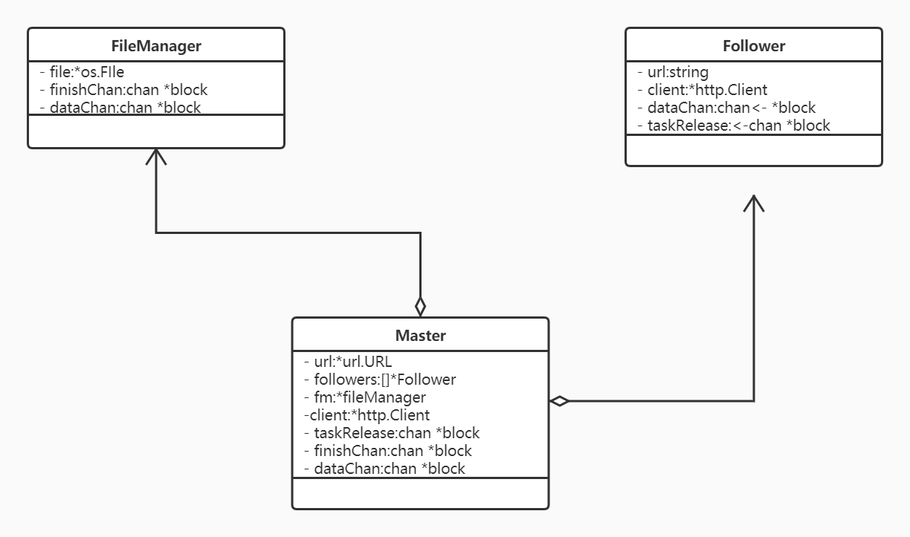

# faye

faye 是一个使用纯golang语言编写的多线程下载器

> 喜欢的可以给个star,pr

## About

* 整个包只暴露了Master，用户只需要创建master，就可以进行下载
* Master管理全局，负责将整个文件切分创建任务，并将任务分配给follower；同时负责从fileManager接受完成的block，并记录已完成的block数
* fileManager对应一个文件，负责从follower处接受block，并将block.data写入相应文件，完成后将block传送给Master记录
* Follower对应一个线程，负责根据master传来的地址下载
* block代表任务和结果，follower根据block的start，end属性确定Range：bytes=start-end头，block.data是下载的文件段，是[]byte类型
* block的传输全部依靠channel
## Versions

### version1.0.0
* 初步实现了多线程下载功能
### version1.1.0
* 增加了progressbar
